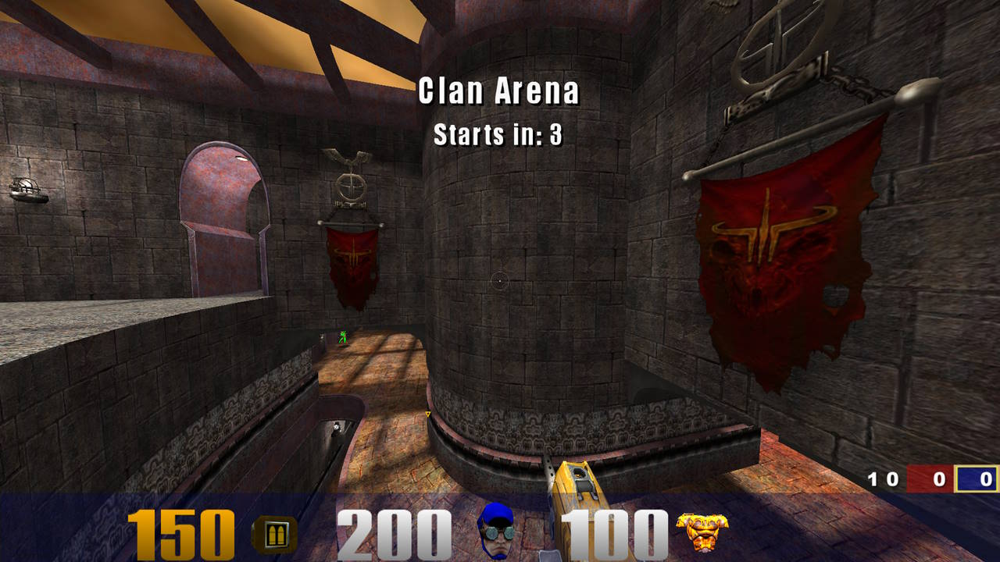

# Quake III Ultimate Arena

Mod based off of Kr3m's [missionpackplus](https://github.com/Kr3m/missionpackplus) with QL features, gametypes, and more!
 
**This is not a replacement for Team Arena! TA maps and virtually all their textures aren't included, meaning you'd still have to legally purchase Team Arena in order to enjoy all of its maps, along with most custom ones designed for TA!**

## Features
* FFA Arena and Clan Arena gametypes.
* Vanilla HUD with loading TA/QL .menu custom huds optional
* Heavy Machinegun from Quake Live
* Mostly QL-compatible `factories.txt` and `*.factories` scripts support
* QL-Style nail bounce
* QL-Style Teammate POIs (`cg_drawFriend 2`)
* Green armor
* Flag POIs
* HUD files from QL parse without error. This project strives for near-total CG and UI scripts compatibility with both MPP and QL.
* Unlagged, Instagib, PM/FB skins and much more from missionpackplus

## Screenshots
      
## Configuration Guides

For detailed setup instructions based on your use case, please refer to the specific configuration guides:

* [Client Configuration Guide](docs/CLIENT.md) — For client-sided configuration.
* [Server Configuration Guide](docs/SERVER.md) — For server administrators and hosts.

## Installation
 1. Download the release from the side
 2. Extract the ```missionpack2``` folder into your Quake 3 install folder. The ```missionpack2``` folder should be same folder as ```quake3.exe``` file and ```baseq3``` folder.
 3. Ensure directory looks as follows:
 ```
|-C:\Program Files {x86)\Steam\steamapps\common\Quake 3 Arena\ (or something)
   |-quake3.exe
   |-baseq3\
      |-pak0.pk3
      |-...
   |-missionpack2\
      |-pakXXX.pk3
      |-...
 ```

## Launching
#### Windows
 - Inside the ```missionpack2``` folder, run ```missionpack2.bat```. If you installed correctly off of CD, Steam, or GOG retail copies, the game should launch.

## Batch Build (Legacy)
The build system included should be completely portable provided that you are on Windows (with Powershell for final pk3 zipping command).
1. Download the repository in zip file
2. Make a gamedir folder in the root of your Quake 3/ioquake3 install called `missionpack2`
3. Extract the *contents* of the repository folder into `missionpack2`
4. Navigate to `missionpack2\src`
5. Run `make.bat` -- this will compile all 3 QVM modules, copy assets and create core/map .pk3 files ready to go
6. Use the `missionpack2.bat` file in its place to run. Alternatively, as always, you can start the mod with any engine of your choice:
  `<ENGINE_BINARY>.exe +set fs_game missionpack2`
7. FIGHT!

## CMake Build
The build system included should be completely portable on both Windows (the original `bin/windows` QVM toolchain `.exe`s are used automatically) and Linux (the native `bin/linux` QVM toolchain is used automatically, no Wine required).
1. Download the repository in zip file
2. Make a gamedir folder in the root of your Quake 3/ioquake3 install called `missionpack2`
3. Extract the *contents* of the repository folder into `missionpack2`
4. Navigate to `missionpack2/src` (`missionpack2\src` on Windows)
5. Run:

   Linux:
   ```
   cmake -B ~/.cmakebuild .
   cmake --build ~/.cmakebuild --target release
   cmake --build ~/.cmakebuild --target release_aux
   ```

   Windows:
   ```
   cmake -B %temp%\cmakebuild .
   cmake --build %temp%\cmakebuild --target release
   cmake --build %temp%\cmakebuild --target release_aux
   ```

   This will compile all 3 QVM modules, copy assets and create core/map .pk3 files ready to go (use `--target debug_deploy` for a loose, always-`-DDEBUG` deploy instead)
6. Use the `missionpack2.bat` file in its place to run. Alternatively, as always, you can start the mod with any engine of your choice:
  `<ENGINE_BINARY>.exe +set fs_game missionpack2`
7. FIGHT!

## To do
* Gametypes 
   * Freeze Tag
   * Domination
   * Attack/Defend
   * Red Rover
   * Race
* Client
   * Put in the rest of QL feedback like last standing, etc
* HUD
   * Get to 100% Quake Live HUD files compatibility
   * Fix certain things with VHUD like switch back to fixed width chars instead of TA font
* Other
   * Fix scores still being weird pre-round and spectator
   * Bot improvements: bunny hop and use grapple(?)
   * Off-hand hook(?)
   * Figure out a nice way to show dead players in scoreboard for round-based gamemodes(?)

 ## Credits
 - **Kevin "Kr3m" Remisoski** for missionpackplus and foundation mods (see <https://github.com/Kr3m/missionpackplus> for additional credits for unlagged code, etc)
 - **Kevin "79DieselRabbit" Worrel** for Frozen Colors map (named as mp2team1 -- we needed at least one amazing custom map supporting 1FCTF, etc)
 - **Mindi "Hubster" Burji** for his famous Aerowalk conversion (named as mp2tourney1 -- green armor!)
 - **Promode Team** PM and FB skins
 - **Dimmskii** for UI work and upscales, QL model conversions, coding, anything else I forgot to mention
 - **Id Software** for Almost Lost map, and everything else making all of this possible!
