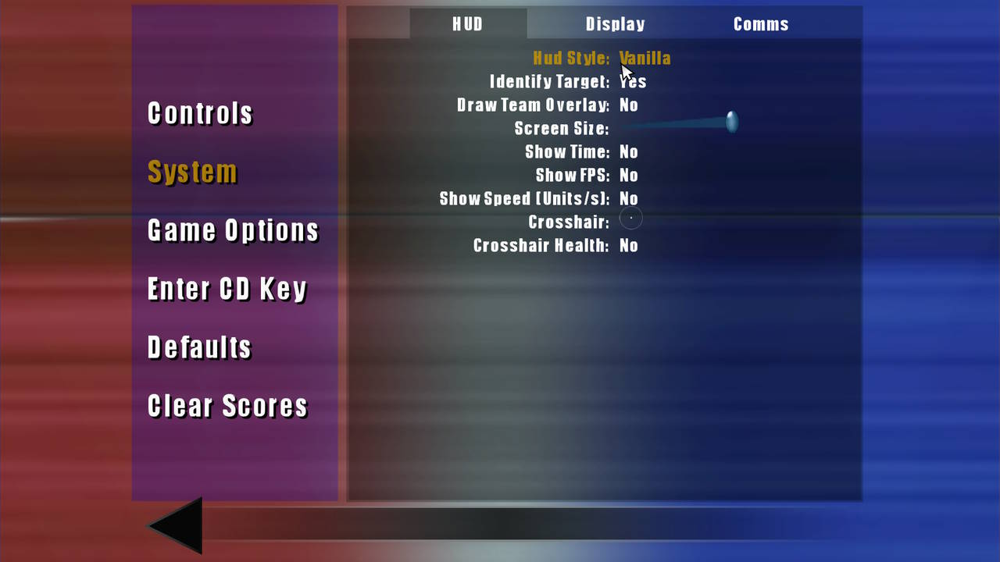
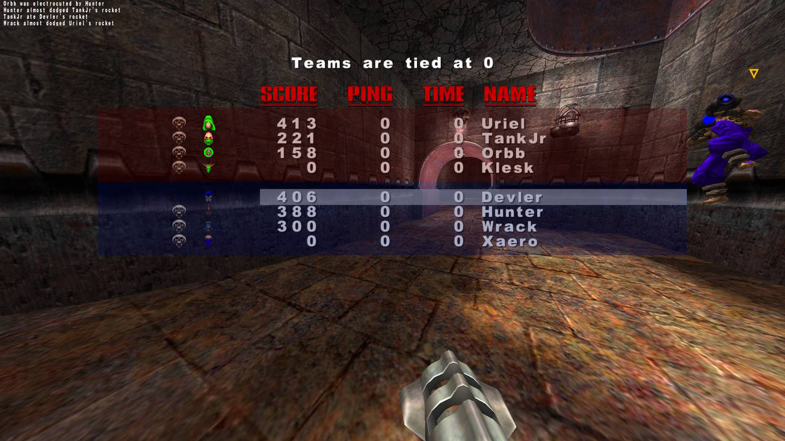
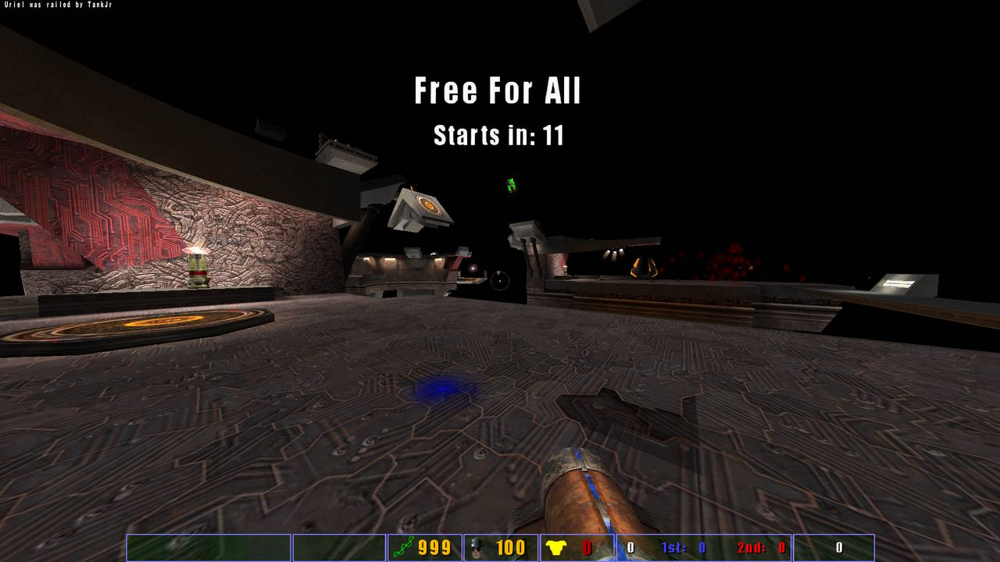
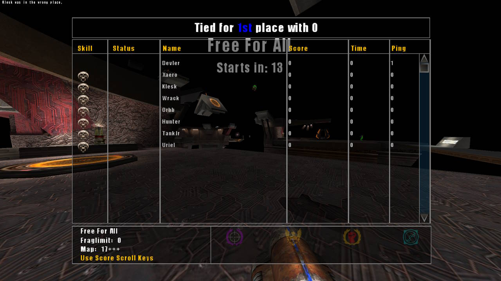

# Quake III Ultimate Arena Client Configuration

## 1. HUD

Ultimate Arena ships two HUD styles and lets you switch between them live - no map reload needed.

### Choosing your HUD in the menu

**Setup → Game Options → HUD tab → "Hud Style"**. Cycling this option applies the change immediately (behind the scenes it runs the `loadhud` command for you).



*The "Hud Style" option at the top of the Setup → Game Options → HUD tab. It cycles between `Vanilla` and `MPP`.*

### The two styles

**Vanilla (VQ3)** - the classic Quake III status bar and score box. This is the **default**.




**MPP** - the custom itemDef/menuDef `.menu`-driven HUD inherited from *missionpackplus* (Kr3m). Widescreen-aware.





### The `cg_hudFiles` cvar (and switching from the console)

The HUD style is really just the `cg_hudFiles` cvar (`CVAR_ARCHIVE`, so it persists):

| Value | HUD |
| --- | --- |
| `""` (empty string) | Vanilla Q3 HUD *(default)* |
| `"ui/hud_mpp.txt"` | MPP custom `.menu` HUD |

Setting `cg_hudFiles ""` disables loading the Team Arena / Quake Live `.menu` HUD files altogether and draws the built-in vanilla status bar instead. If `cg_hudFiles` points at a `.menu` config that can't be found, the game doesn't error out to the main menu - it prints a yellow console warning and falls back to the vanilla HUD (same as `""`).

Changing the cvar alone does **not** reapply the HUD immediately. After setting it from the console, run **`loadhud`** to apply it live (this is the exact command the menu uses):

```
cg_hudFiles ""                  // vanilla Q3 HUD
loadhud

cg_hudFiles "ui/hud_mpp.txt"    // custom MPP HUD
loadhud
```

---

## 2. General Cvars

General config improvements upon vanilla Q3/TA:

| Variable | Default | Description |
| --- | --- | --- |
| `cg_trueLightning` | `0.0` | Controls lightning shaft flexibility. At `1.0`, the beam sticks perfectly straight to your crosshair vector with zero lag-bending. |
| `cg_kickScale` | `0` | Sets screen vibration scaling factors when sustaining damage. Set to `0` to completely disable screen shake during combat. |
| `cg_hitSounds` | `0` | Hit sound mode |
| `cg_forceEnemyModel` | ` ` | Forces all enemy players to one model, optionally with a skin (e.g., `keel` or `keel/pm`). Set to empty string to disable. |
| `cg_forceEnemySkin` | ` ` | Forces the skin on enemy players without touching their model (e.g., `pm`, `fb`). Applied after the model, so it wins the skin slot. Set to empty string to disable. |
| `cg_forceTeamModel` | ` ` | As `cg_forceEnemyModel`, but for teammates and yourself. |
| `cg_forceTeamSkin` | ` ` | As `cg_forceEnemySkin`, but for teammates and yourself. |
| `cg_enemyHeadColor` | `0x2a8000FF` | Head color of enemy pm/fb skins. Accepts `#RGB`, `#RRGGBB` or `#RRGGBBAA`, with `#`, `0x` or no prefix; alpha is ignored on player models. Set to empty string for the team color. |
| `cg_enemyUpperColor` | `0x2a8000FF` | Torso color of enemy pm/fb skins, same format. |
| `cg_enemyLowerColor` | `0x2a8000FF` | Legs color of enemy pm/fb skins, same format. |
| `cg_teamHeadColor` | ` ` | Head color of teammate (and your own) pm/fb skins, same format. |
| `cg_teamUpperColor` | ` ` | Torso color of teammate (and your own) pm/fb skins, same format. |
| `cg_teamLowerColor` | ` ` | Legs color of teammate (and your own) pm/fb skins, same format. |
| `modelColorHead` | ` ` | Head color of *your own* pm/fb skin, broadcast to everyone else on the server. Same format as the cvars above. Set to empty string for white. Only applies while your own skin is `pm` or `fb`; other players can still override it with their force/color cvars. Settable from the Player menu. |
| `modelColorUpper` | ` ` | Torso color of your own pm/fb skin, same format. |
| `modelColorLower` | ` ` | Legs color of your own pm/fb skin, same format. |
| `effectsColor1` | ` ` | Hex color of *your own* rail core, rail trail and railgun pickup tint, broadcast to everyone else. Hex only (`#RGB`, `#RRGGBB` or `#RRGGBBAA`, with `#`, `0x` or no prefix); alpha is ignored. **Set to empty string to fall back to `color1`**, which keeps working as the vanilla `1`-`7` value. Settable from the Player menu. |
| `effectsColor2` | ` ` | As `effectsColor1`, but for your rail rings. Falls back to `color2` when empty. |
| `cg_forceRedTeamModel` | ` ` | Accepted for Quake Live config compatibility. No effect. |
| `cg_forceBlueTeamModel` | ` ` | Accepted for Quake Live config compatibility. No effect. |
| `cg_deadBodyDarken` | `1` | Automatically darkens dropped player corpses lying on the map floor to increase visibility contrast with combatants. |
| `cg_fovAdjust` | `0` | Automatically scales focal viewing calculations to properly compensate for modern widescreen aspect ratio variations. |
| `cg_followKiller` | `0` | Directs the spectator follow-cam system to automatically focus over the player who eliminated you. |
| `cg_oldPlasma` | `1` | Enables vanilla plasma effect. Default `1`. |
| `cg_oldRail` | `1` | Enables vanilla rail effect. Default `1`. |
| `cg_oldRocket` | `1` | Enables vanilla rocket effect. Default `1`. |
| `cg_killBeep` | `0` | Plays a confirmation beep locally when you score a kill (not suicides/world deaths). `0` = Off, `1` = On (plays a single fixed sound currently). *Planned: QL-style preset selection via other integer values (different beep sounds), not implemented yet.* |

---

## 3. Team/Item/Flag Markers and Timer Cvars

These variables control the global behavior and rendering constraints for all overhead Point of Interest indicators:

| Variable | Default | Description |
| --- | --- | --- |
| `cg_drawFriend` | `1` | `0`=Vanilla off behavior `1`=Vanilla indicators `2`=QL-styled always visibile 'POIs' |
| --- | --- | --- |
| `cg_poiTextBgAlpha` | `0.3` | Adjusts the background transparency of text elements attached to POI indicators. This includes the timer text above item POIs. |
| `cg_poiMaxDist` | `32768` | Sets the maximum distance in game units at which POIs remain visible on the screen. A linear alpha fade is applied between zero distance and max. |
| --- | --- | --- |
| `cg_teammatePOIs` | `1` | Quake Live compatibility R/O cvar. Automatically enables/disables itself depending on whether or not `cg_drawFriend` is `2`. |
| `cg_teammateNames` | `1` | Controls visibility behavior for player names above teammate POIs:<br>• `0`: Off<br>• `1`: Targeted (only when looking toward them)<br>• `2`: Always on.<br>*Requires `cg_drawFriend 2`.* |
| `cg_teammatePOIsIconSize` | `8` | Sets the initial size for teammate POI pics. *Requires `cg_drawFriend 2`.* |
| `cg_teammatePOIsIconMinSize` | `4` | Sets the minimum (furthest-distance) size for teammate POI pics. *Requires `cg_drawFriend 2`.* |
| `cg_teammatePOIsIconMaxSize` | `12` | Sets the maximum size for teammate POI pics icons up close. *Requires `cg_drawFriend 2`.* |
| --- | --- | --- |
| `cg_itemTimers` | `1` | *(Currently has no effect)* Reserved for a planned separate item-timer system, not yet built - not part of the POI code despite the name suggesting otherwise. |
| --- | --- | --- |
| `cg_powerupPOIs` | `0` | *(Currently has no effect)* Master toggle for rendering POIs over powerup spawners (Quad, Battlesuit, Haste, etc) - the code path that checks this cvar is currently disabled pending a powerup-stacking fix, so powerup POIs never draw regardless of this setting. |
| `cg_powerupPOIsTimers` | `1` | Controls visibility of timer texts above powerup POIs:<br>• `0`: Off<br>• `1`: Targeted (only when looking toward them)<br>• `2`: Always on.<br>*Requires `cg_powerupPOIs 1`.* |
| `cg_powerupPOIsIconSize` | `24` | Sets the initial size of powerup POI pics. |
| `cg_powerupPOIsIconMinSize` | `4` | Sets the minimum (furthest-distance) size of powerup POI pics. |
| `cg_powerupPOIsIconMaxSize` | `12` | Limit the scaling limit for powerup POI pics up close. |
| --- | --- | --- |
| `cg_flagPOIs` | `0` | Master toggle for rendering POIs over flag carriers/spawns (team games). `0` = Off, `1` = On. |
| `cg_flagPOIsTexts` | `0` | Controls visibility of contextual text (RETRIEVE/ATTACK/DEFEND) above flag POIs. `0` = Off, `1`/`2` = targeted/always, same convention as other POI text cvars. *Requires `cg_flagPOIs 1`.* |
| `cg_flagPOIsIconSize` | `24` | Sets the initial size of flag POI pics. |
| `cg_flagPOIsIconMinSize` | `10` | Sets the minimum (furthest-distance) size of flag POI pics. |
| `cg_flagPOIsIconMaxSize` | `24` | Limit the scaling limit for flag POI pics up close. |

---
